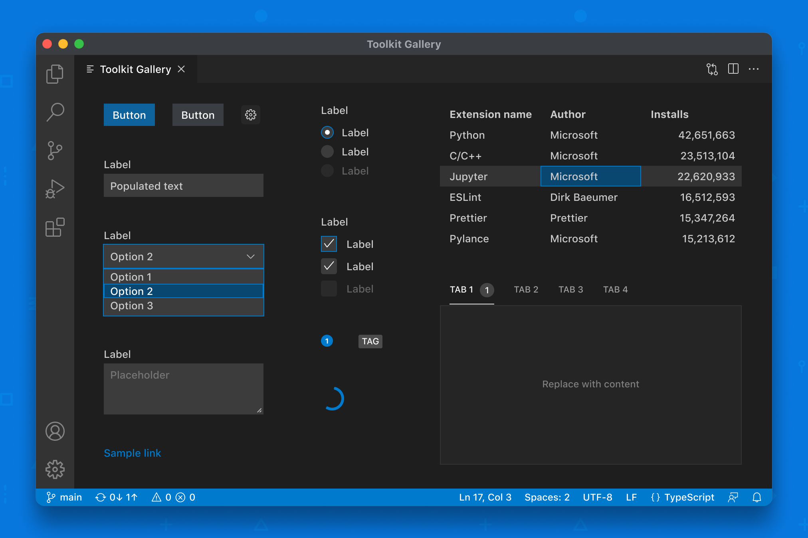

# Webview UI Toolkit for Visual Studio Code


[](https://www.npmjs.com/package/@vscode/webview-ui-toolkit)
[](./LICENSE)




## Introduction

The Webview UI Toolkit is a component library for building [webview-based extensions](https://code.visualstudio.com/api/extension-guides/webview) in Visual Studio Code.

Features of the library include:

-   **Implements the Visual Studio Code design language:** All components follow the design language of Visual Studio Code – enabling developers to create extensions that have a consistent look and feel with the rest of the editor.
-   **Automatic support for color themes:** All components are designed with theming in mind and will automatically display the current editor theme.
-   **Use any tech stack:** The library ships as a set of web components, meaning developers can use the toolkit no matter what tech stack (React, Vue, Svelte, etc.) their extension is built with.
-   **Accessible out of the box:** All components ship with web standard compliant ARIA labels and keyboard navigation.

## Getting started

Follow the [Getting Started Guide](./docs/getting-started.md).

If you already have a webview-based extension, you can install the toolkit with the following command:

```
npm install --save @vscode/webview-ui-toolkit
```

## Documentation

Further documentation can be found in the following places:

-   [Component Docs](./docs/components.md)
-   [Toolkit Extension Samples](https://github.com/microsoft/vscode-webview-ui-toolkit-samples)
-   [Figma Toolkit](https://www.figma.com/community/file/1071566662997054792/Webview-UI-Toolkit-for-Visual-Studio-Code)
-   [Storybook (Interactive Component Sandbox)](https://microsoft.github.io/vscode-webview-ui-toolkit/)
-   [Visual Studio Code Webview Guide](https://code.visualstudio.com/api/extension-guides/webview)
-   [Visual Studio Code Webview Guidelines](https://code.visualstudio.com/api/references/extension-guidelines#webviews)
-   [Visual Studio Code Extension API Docs](https://code.visualstudio.com/api)

## A note on webview usage

Webviews are a powerful way to add custom functionality that is beyond what the VS Code API supports. They are fully customizable, which has historically meant that the responsibility of developing UI that aligns with the VS Code design language and follows our [webview guidelines](https://code.visualstudio.com/api/references/extension-guidelines#webviews) lies in the hands of extension authors.

The Webview UI Toolkit shifts _some_ of this responsibility away from extension developers by providing core components that make it easier to build higher quality webview UIs in VS Code.

With all this said, we still strongly encourage a careful review of whether your extension needs to use webviews or not before building. While webviews provide a great way to add custom functionality it often comes at the cost of performance and accessibility.

The core VS Code API provides a vast array of building blocks for highly performant, accessible, and tighly integrated extension experiences and we will generally encourage their usage before webviews. If you haven't already, feel free to check out this [overview of API capabilities](https://code.visualstudio.com/api/extension-capabilities/overview) to get an idea of what's possible.

Finally, if you are ever unsure if your extension should make use of webviews or not, please open an issue and we would be more than happy to give some feedback and guidance.

## Release

The Webview UI Toolkit is currently in a public preview with the goal of reaching `v1.0` sometime in Winter 2022.

## Contributing

See the [contributing](./CONTRIBUTING.md) documentation.

## Legal notices

Microsoft and any contributors grant you a license to any code in the repository under the [MIT License](https://opensource.org/licenses/MIT), see the [LICENSE](LICENSE) file.

This project may contain trademarks or logos for projects, products, or services. Authorized use of Microsoft trademarks or logos is subject to and must follow [Microsoft’s Trademark & Brand Guidelines](https://www.microsoft.com/en-us/legal/intellectualproperty/trademarks). Use of Microsoft trademarks or logos in modified versions of this project must not cause confusion or imply Microsoft sponsorship. Any use of third-party trademarks or logos are subject to those third-party’s policies.

Privacy information can be found [here](https://privacy.microsoft.com/en-us/).

Microsoft and any contributors reserve all other rights, whether under their respective copyrights, patents, or trademarks, whether by implication, estoppel or otherwise.
